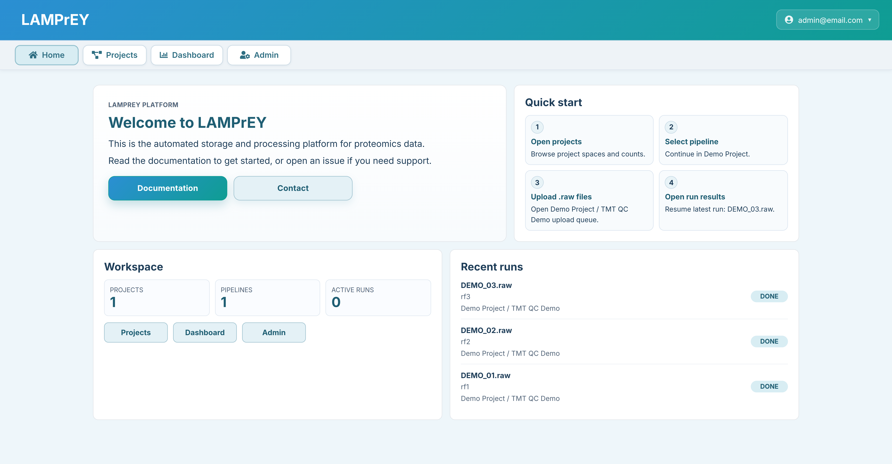
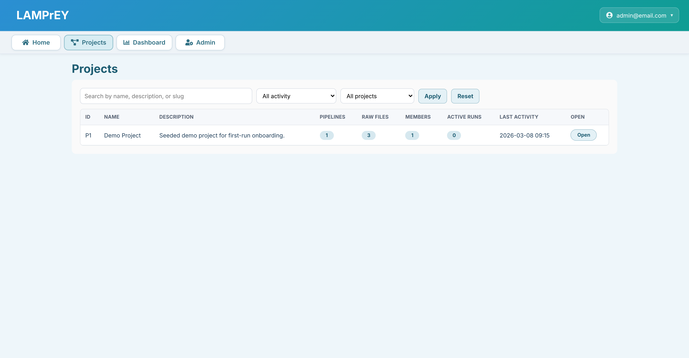
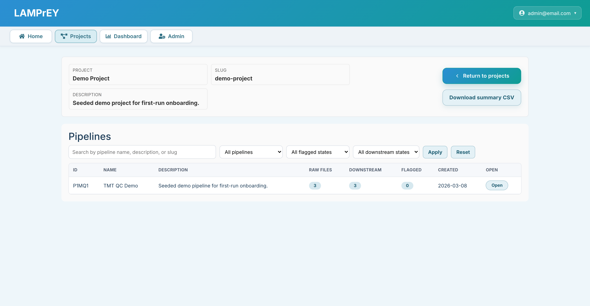
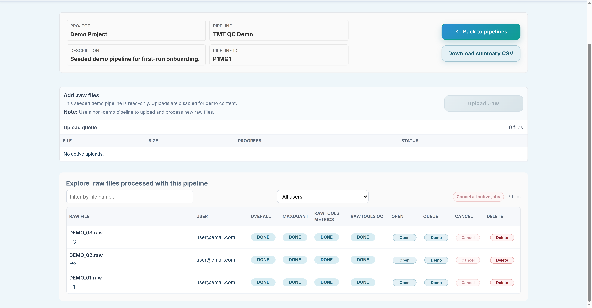
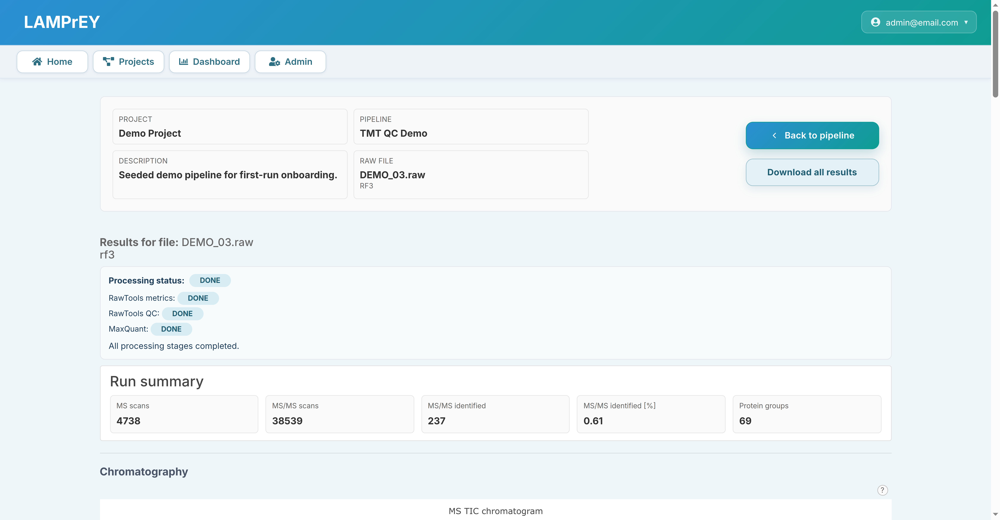

# Demo data

LAMPrEY ships with a seeded demo so a fresh installation is immediately usable after `make init` or `make init-local`.

The demo is created by the `bootstrap_demo` management command, which is invoked automatically during first-time setup.



## What the demo includes

- a demo project with a seeded pipeline named `TMT QC Demo`
- bundled pipeline configuration from `app/seed/demo/`
- three pre-generated demo runs
- minimal MaxQuant, RawTools metrics, and RawTools QC outputs required for the UI and dashboard

The bundled assets are intentionally small. They are meant to support onboarding and interface exploration, not to act as a full raw-data archive.

## What the demo is for

Use the demo to:

- verify that the installation completed successfully
- explore the pipeline detail page and run-status table
- open the dashboard and review seeded QC metrics and plots
- inspect how MaxQuant and RawTools outputs are presented in the web UI

## Explore the demo

After first-time setup, the demo is the easiest way to understand the application without creating any new resources.

### Projects page

Start from the project list.

- open the seeded demo project
- review how projects group pipelines and organize work
- use this page as the top-level entry point into the proteomics workflows



### Pipeline page

Inside the demo project, open the `TMT QC Demo` pipeline.

- review the pipeline header and description
- inspect the seeded run list
- see how run status is broken down into overall, MaxQuant, RawTools metrics, and RawTools QC states



### Upload page

The pipeline page also shows the upload area that would normally be used for new `.raw` files.

- in the demo pipeline, uploads are intentionally disabled
- the disabled state shows what a read-only seeded pipeline looks like
- use a non-demo pipeline when you want to submit your own files



### Results pages

Open any of the seeded demo runs from the pipeline table.

- inspect the run detail page
- review the generated MaxQuant and RawTools outputs
- use the dashboard to explore the same seeded data from an aggregate QC perspective



## Important limitations

The seeded demo pipeline is read-only.

- uploads are blocked on the demo pipeline
- demo runs cannot be requeued as normal uploaded runs
- to process your own `.raw` files, create or use a non-demo pipeline

This is intentional. The demo exists to provide a stable first-run experience and to avoid mutating the shipped example dataset.

## Rebuild or refresh the demo

If you want to seed the demo again manually, run:

<div class="termy">

```console
$ make bootstrap-demo

// Or use the development-stack variant
$ make bootstrap-demo-local
```

</div>

Both commands call Django's `bootstrap_demo` management command with `--with-results`, so the seeded runs include ready-to-browse result data.

## Demo storage

The source assets live in `app/seed/demo/` and include:

- `config/`: demo `mqpar.xml` and `fasta.faa`
- `runs/demo_01..demo_03/maxquant/`: minimal MaxQuant outputs
- `runs/demo_01..demo_03/rawtools/`: RawTools metrics and chromatograms
- `runs/demo_01..demo_03/rawtools_qc/`: RawTools QC outputs
- `manifest.json`: the ordered list of seeded demo runs and displayed raw-file names

For implementation details, see `app/seed/demo/README.md`.
