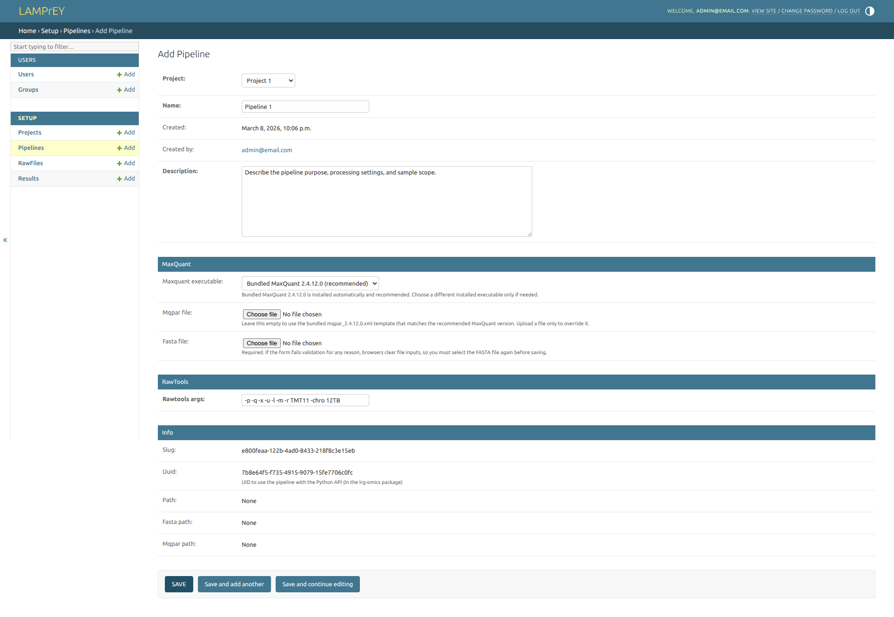

# How to create a new pipeline?

A pipeline defines the processing steps for raw data files. Each pipeline belongs to a project and can be configured with specific parameters and input files for [Maxquant](https://maxquant.org/) and [RawTools](https://github.com/kevinkovalchik/RawTools). To add a new pipeline, you need to have at least one project set up in the system. If you haven't created a project yet, please refer to [Create a project](how-to-add-a-project.md) before proceeding.

Click on the `+ Add` button beside `Pipelines` to open the pipeline creation form:

Fill in the editable fields and upload the required configuration:

1. Select the MaxQuant version. If no explicit version is selected, the default bundled version (2.4.12.0) is used.
2. Add a `FASTA` file with the target protein sequences.
3. Add an `mqpar.xml` file generated with MaxQuant. If no explicit mqpar.xml is submitted, the default mqpar.xml file for bundled version (2.4.12.0) is used.
4. Provide command-line parameters for [RawTools](https://github.com/kevinkovalchik/RawTools). Read [RawTools help](https://github.com/kevinkovalchik/RawTools/wiki/Run-RawTools-for-parsing-and-quantification-for-Linux) for the supported arguments.

After saving the pipeline:

- project members can upload `.raw` files to it from the pipeline page or via the API
- each uploaded file creates an independent run, even when the displayed filename matches a previous upload
- the seeded demo pipeline is read-only and blocks new uploads
