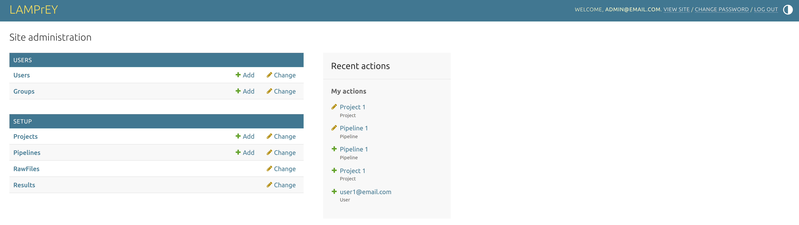
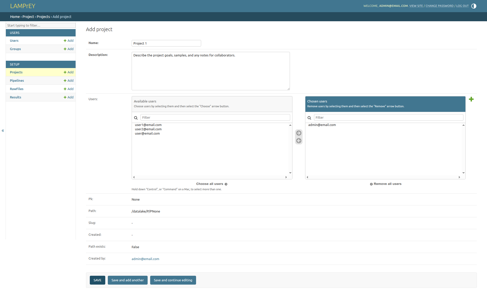
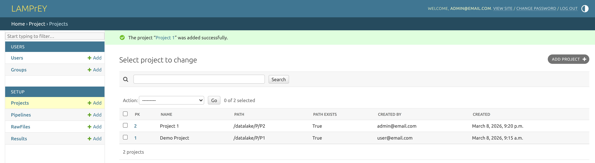

# How to create a new project?

A project is a logical container for pipelines. Each project can contain multiple pipelines and all files 
submitted to certain or added within a certain project will be stored in a dedicated project directory in
the datalake. 

To set up a new pipeline, login to the [admin panel](how-to-access-the-admin-panel.md).

Click on the `+ Add` button beside `Projects` to open the project creation form:

Here, fill up the editable fields (name and a description). Default names are provided for these fields, but you can change them. The `name` field is required, while the `description` field is optional. In this example we call the new project `Project 1`. By default, admin accocunts are assigned to new projects, but you can change that in the `users` field. You can also assign other users to the project here, or do that later by editing the project. Then click on `SAVE` to create the new project.

You will be redirected to the _Projects Overview_ and the new project appears on the top of the list:

