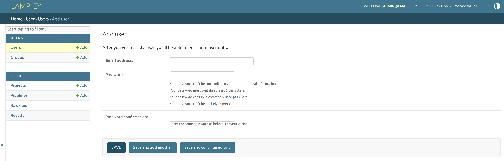
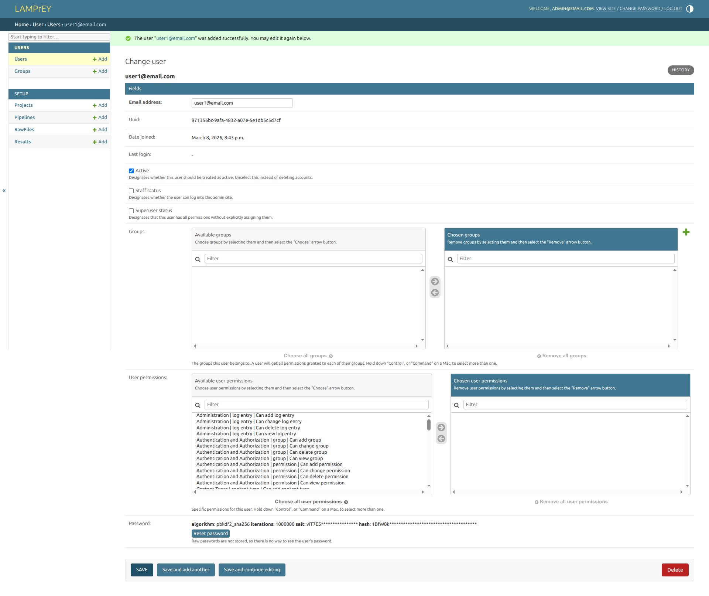
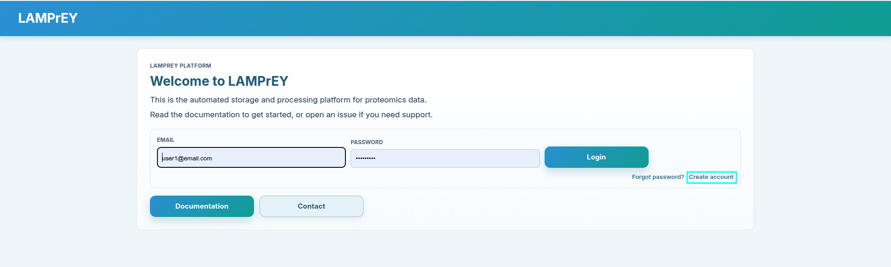
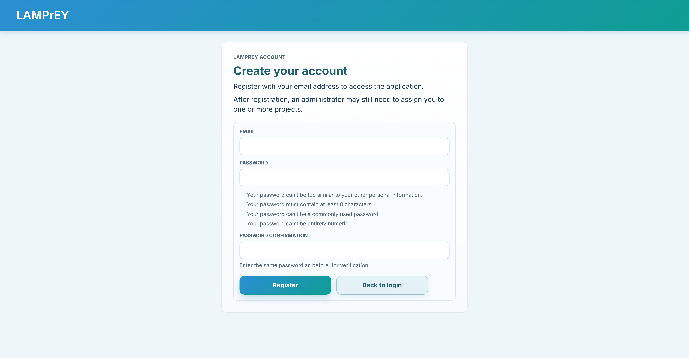

# How to add a user?

Accounts for new users can be created directly from the admin panel. Sign in to the [admin panel](how-to-access-the-admin-panel.md), and click the `+ Add` button beside `Users` to open the user creation form.

Provide:

- the user's email address
- a password
- the password confirmation

After saving the initial form, you can edit the account further and decide whether the user should have elevated privileges.

Important fields:

- `is_active`: allows the account to sign in
- `is_staff`: grants access to the admin interface
- `is_superuser`: grants full administrative access
- `groups` and `user_permissions`: optional Django permission controls

## Give the user access to projects

Creating the user account alone is not enough for normal project access.

To let the user work with project data:

1. open the relevant project in the admin panel
2. add the user in the project's `users` field
3. save the project

Once assigned to a project, the user can sign in and access the project, its pipelines, and related runs according to their permissions.

## Self-registration

If you prefer not to create accounts manually, users can also register from the application 
at `http://localhost:8000/user/register/`.

That creates the account, but an administrator may still need to assign the user to one or more projects before the user can work with project data.
