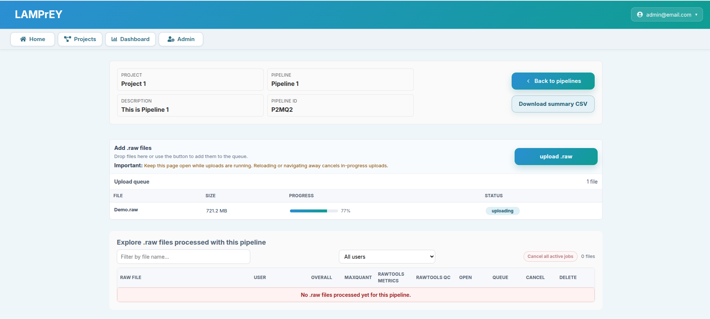
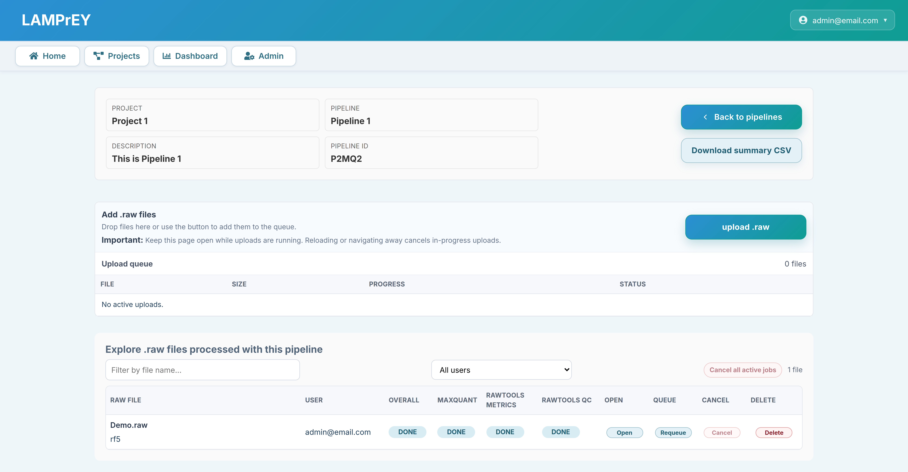

# How to submit RAW files to an existing pipeline?

There are two ways to add new raw files to an existing pipeline.

## 1. Web frontend
The most straightforward way to submit RAW files to an existing pipeline
is the web frontend. After setting up a pipeline, navigate to:

`Projects -> Your project -> Your pipeline -> Upload RAW`

Then click `upload .raw` and select one or more files. The page now shows an upload queue with per-file progress and status updates.

Important behavior:

- keep the page open while uploads are running; navigating away or reloading cancels in-progress browser uploads
- the seeded demo pipeline is read-only, so uploads are blocked there
- duplicate filenames are allowed; each upload creates a separate run
- after upload, the pipeline page shows a run table with overall status plus separate MaxQuant, RawTools metrics, and RawTools QC statuses
- the uploader, staff, and superusers can requeue, cancel, or delete their runs from that table

## 2. Using the API

You can upload a RAW file using the API as described [here](api.md).
API uploads require an authenticated session and a pipeline UUID (`pid`) that belongs to one of your projects.

